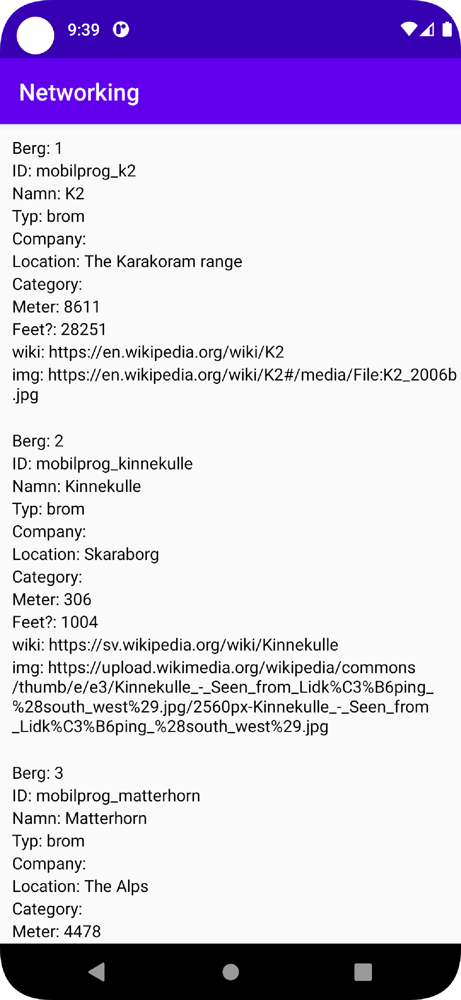
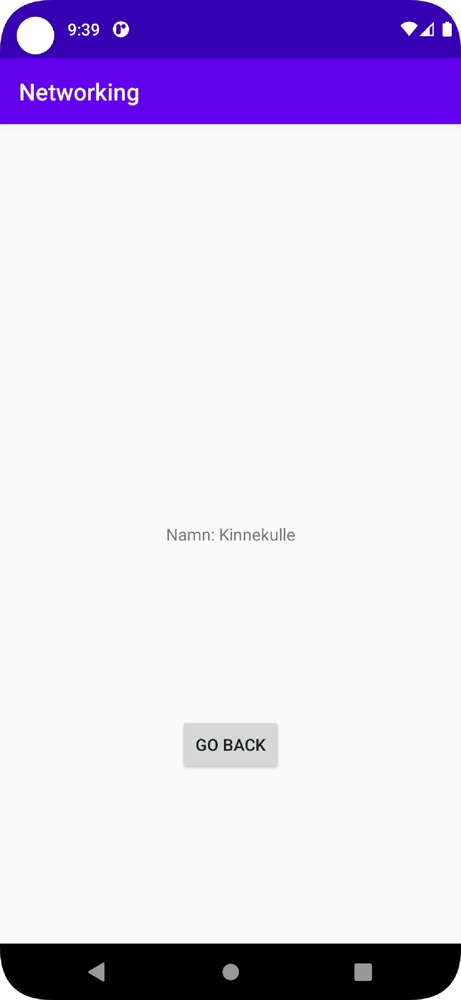

# Rapport

Skapat layout xml för en recycler view och item för recycler view.
Varje item kommer ta emot data från Json.
Skapat en Lista med Mountain object.
```Java
 public void onPostExecute(String json) {
         Log.d("MainActivity", "berg lista: " + bergLista.size());
         Log.d("MainActivity", json);
         Gson gson = new Gson();
         Type type = new TypeToken<List<Mountain>>(){}.getType();
         bergLista = gson.fromJson(json, type);
         Log.d("MainActivity", "berg lista1: " + bergLista.size());
         bergAdapter.setBergLista(bergLista);
         bergAdapter.notifyDataSetChanged();
     }
```
Skapt en MountainAdapter och Mountain klasser
Mountain klassen innehåller String och int för att ta emot datan från json.
Även AuxData klass som en instance i Mountain klassen om data från Json behöver sparas där
Gjort getters för varje string och int i mountain och auxdata
```Java
    String ID;
    AuxData auxdata;
    public AuxData getAuxData() {
        return auxdata;
    }
    public String getID() {
        return ID;
    }
```

I MountainAdapter, tar emot listan med berg och mainactivity
```Java
public MountainAdapter(List<Mountain> berg, MainActivity activity){
        this.bergLista = berg;
        this.mainActivity = activity;
    }
```
Kopplat varje string och int från mountain instancen till list_item genom view holder och använder getters från mountain för att hämta data att visa upp.
```Java
 public void onBindViewHolder(@NonNull MountainAdapterViewHolder holder, int position) {
        holder.MountainTextView.setText("Berg: " + (1 + bergLista.indexOf(bergLista.get(position))));
        holder.ID.setText("ID: " + bergLista.get(position).getID());
        holder.name.setText("Namn: " + bergLista.get(position).getName());
        holder.type.setText("Typ: " + bergLista.get(position).getType());
        holder.company.setText("Company: " + bergLista.get(position).getCompany());
        holder.location.setText("Location: " + bergLista.get(position).getLocation());
        holder.category.setText("Category: " + bergLista.get(position).getCategory());
        holder.size.setText("Meter: " + bergLista.get(position).getSize());
        holder.cost.setText("Feet?: " + bergLista.get(position).getCost());
        holder.wiki.setText("wiki: " + bergLista.get(position).getAuxData().getWiki());
        holder.img.setText("img: " + bergLista.get(position).getAuxData().getImg());
    }
```
```Java
 public MountainAdapterViewHolder(@NonNull View itemView) {
            super(itemView);
            MountainTextView = itemView.findViewById(R.id.bergListTextItem);
            ID = itemView.findViewById(R.id.ID);
            name = itemView.findViewById(R.id.name);
            type = itemView.findViewById(R.id.type);
            company = itemView.findViewById(R.id.company);
            location = itemView.findViewById(R.id.location);
            category = itemView.findViewById(R.id.category);
            size = itemView.findViewById(R.id.size);
            cost = itemView.findViewById(R.id.cost);
            wiki = itemView.findViewById(R.id.wiki);
            img = itemView.findViewById(R.id.img);
```
Lade till en knapp som gör hela list_item till en knapp och skickar med namnet på berget till den nya activityn
```Java
 itemView.setOnClickListener(new View.OnClickListener() {
                @Override
                public void onClick(View view) {
                    Log.d("RecyclerView", "onClick：" + getBindingAdapterPosition());
                    clickToSecond();
                }
            });
        }
        void clickToSecond(){
            Log.d("RecyclerView", "onClick：START SECOND ACTIVITY");
            Intent intent = new Intent(mainActivity, SecondActivity.class);
            intent.putExtra("Test", "" + name.getText());
            mainActivity.startActivity(intent);
        }
```
I den nya activityn finns en till knapp som gör att man kan gå tillbaka till listan
```Java
button.setOnClickListener(new View.OnClickListener() {
            @Override
            public void onClick(View view) {
                goBackToMain();
            }
        });
    }
    void goBackToMain(){
        finish();
    }
```


